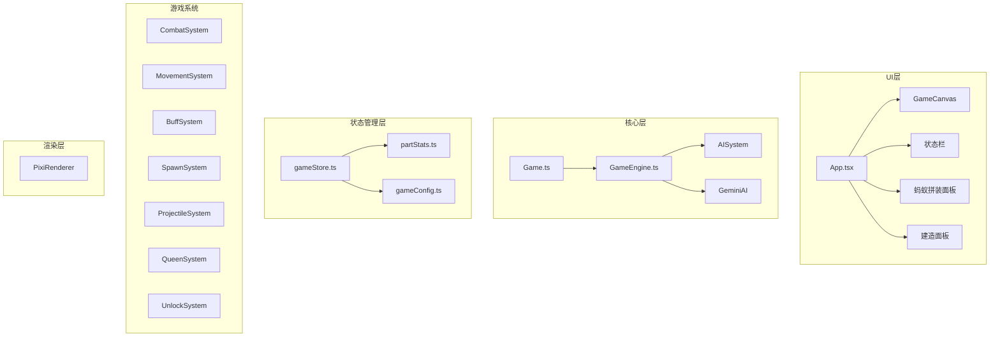

# 蚁巢争霸 - 游戏架构文档

## 项目概述

一款策略性拔河游戏，玩家通过建造孵化室、组装不同部件的蚂蚁来对抗AI敌人。游戏采用实时战斗机制，双方蚂蚁自动向敌方基地前进并战斗。

**技术栈**：
- Vite + React 18 + TypeScript
- PixiJS 7 (2D渲染)
- Zustand (状态管理)
- Tailwind CSS (UI样式)

---

## 系统架构图



---

## 目录结构

```
src/
├── components/           # React UI 组件
│   ├── GameCanvas.tsx    # PixiJS 画布包装器
│   ├── StatusBar.tsx     # 顶部状态栏
│   ├── AssemblyPanel.tsx  # 蚂蚁拼装面板
│   ├── BuildPanel.tsx    # 建造/升级/拆除面板
│   └── AITrashTalk.tsx   # AI垃圾话显示
├── config/               # 游戏配置
│   ├── gameConfig.ts     # 游戏参数（地图大小、伤害值等）
│   └── partStats.ts      # 部件属性配置表
├── core/                 # 游戏核心
│   ├── Game.ts          # 游戏主控制器
│   ├── GameLoop.ts      # 游戏循环
│   └── Events.ts        # 事件系统
├── game/                 # 游戏引擎
│   ├── GameEngine.ts    # 游戏引擎（AI/战斗/移动）
│   ├── PixiRenderer.ts  # PixiJS渲染管理器
│   └── GeminiAI.ts      # Gemini API集成
├── store/               # 状态管理
│   └── gameStore.ts     # Zustand Store
├── systems/             # 游戏系统
│   ├── CombatSystem.ts
│   ├── MovementSystem.ts
│   ├── BuffSystem.ts
│   ├── SpawnSystem.ts
│   ├── ProjectileSystem.ts
│   ├── QueenSystem.ts
│   └── UnlockSystem.ts
├── ai/                  # AI系统
│   ├── AISystem.ts
│   └── interfaces/
├── hooks/              # React Hooks
│   └── usePixiApp.ts
├── types/              # TypeScript类型
│   └── index.ts
└── styles/             # 样式文件
    └── index.css
```

---

## 核心类型定义

### Ant (蚂蚁实体)
```typescript
interface Ant {
  id: string;
  side: 'player' | 'enemy';
  hp: number;
  maxHp: number;
  damage: number;
  speed: number;
  attackSpeed: number;
  state: 'moving' | 'chasing' | 'fighting' | 'dead' | 'shooting';
  parts: AntParts;  // 头部/胸部/腹部配置
  buffs: Buff[];   // 当前生效的Buff
  // 特殊能力标记
  hasEscapeAbility: boolean;      // 大齿猛蚁
  hasAttackSpeedAura: boolean;    // 白蚁大兵
  hasStingerAbility: boolean;     // 马塔贝勒蚁腹
  hasTauntAbility: boolean;       // 切叶蚁胸
  hasInstantKill: boolean;       // 大头蚁
  hasHoneypotExplosion: boolean; // 蜜罐蚁腹
}
```

### Hatchery (孵化室)
```typescript
interface Hatchery {
  id: string;
  side: Side;
  gridPos: GridPosition;
  template: AntTemplate;  // 生产的蚂蚁配置
  level: 1-3;
  cost: number;
  totalInvested: number;
}
```

### Buff ( Buff效果)
```typescript
interface Buff {
  id: string;
  type: 'slow' | 'poison' | 'attackSpeedUp' | 'attackSpeedDown' | 'armor';
  value: number;
  duration: number;
  stackable: boolean;
  tickDamage?: number;  // 中毒每秒伤害
}
```

---

## 蚂蚁部件系统

### 头部 (HeadVariant)
| 部件 | 攻击 | 特殊能力 |
|------|------|----------|
| basic | +0 | 无 |
| leafcutter (切叶蚁头) | +15 | 高攻击 |
| soldier (兵蚁头) | +25 | 高攻但减速 |
| fire (火蚁头) | +10 | +20%攻速 |
| odontomachus (大齿猛蚁头) | +10 | **弹射逃脱** |
| termiteSoldier (白蚁大兵头) | +5 | **攻速光环** |
| bigHead (大头蚁头) | +5 | **秒杀** |

### 胸部 (ThoraxVariant)
| 部件 | 移速 | 特殊能力 |
|------|------|----------|
| basic | +0 | 无 |
| army (行军蚁胸) | +30 | 高速 |
| carpenter (木蚁胸) | +10 | 均衡 |
| bullet (子弹蚁胸) | +50 | 极速突击 |
| leafcutter (切叶蚁胸) | +0 | **嘲讽+护甲** |

### 腹部 (AbdomenVariant)
| 部件 | 生命 | 特殊能力 |
|------|------|----------|
| basic | +0 | 无 |
| honeypot (蜜罐蚁腹) | +40 | **死亡回复** |
| weaver (织叶蚁腹) | +60 | 灵活 |
| trap (陷阱蚁腹) | +30 | 爆发 |
| spitter (木蚁腹) | -30% | **远程+减速** |
| matabele (马塔贝勒蚁腹) | +80 | **尾针技能** |

---

## 游戏引擎核心逻辑

### GameEngine 主要职责

1. **游戏循环** (`gameLoop`)
   - 按帧更新游戏状态
   - 管理游戏速度倍率

2. **AI决策系统**
   - `DefaultAIDecisionMaker`: 默认AI，支持三种模式
     - `build_focus`: 扩张优先
     - `upgrade_focus`: 升级优先
     - `iterate`: 迭代替换
   - `LLMAIDecisionMaker`: LLM AI预留接口
   - `Gemini AI`: 每分钟分析战场态势

3. **战斗系统**
   - 索敌检测 (detectionRange: 120px)
   - 近战战斗 (collisionDistance: 25px)
   - 远程攻击 (attackRange: 150px)

4. **特殊能力处理**
   - 大齿猛蚁弹射逃脱
   - 白蚁大兵攻速光环
   - 马塔贝勒蚁腹尾针
   - 切叶蚁胸嘲讽
   - 大头蚁秒杀
   - 蜜罐蚁死亡爆炸

5. **资源系统**
   - 食物生成 (每2秒，初始5，每分钟+1)
   - 拔河优势加成 (+3)
   - 孵化室建造成本

6. **解锁系统**
   - 三阶段解锁 (0min, 5min, 10min)
   - 双方独立随机解锁

### 蚂蚁行为状态机

```
moving ──检测到敌人──> chasing ──进入攻击范围──> fighting (近战)
                                                     │
moving ──远程单位进入射程──> shooting (远程) <───────┘
                                                     │
                        <───敌人逃离/死亡─────────────┘
```

---

## Zustand Store (gameStore)

### 状态结构
```typescript
interface GameStore {
  status: 'idle' | 'playing' | 'paused' | 'victory' | 'defeat';
  playerFood: number;
  enemyFood: number;
  playerQueen: Queen;
  enemyQueen: Queen;
  ants: Ant[];
  projectiles: Projectile[];
  hatcheries: Hatchery[];
  playerTemplate: AntTemplate;
  enemyTemplate: AntTemplate;
  config: GameConfig;
  stats: GameStats;
  playerUnlockedParts: UnlockedParts;
  enemyUnlockedParts: UnlockedParts;
}
```

### 核心方法
- `spawnAntFromHatchery()`: 从孵化室生成蚂蚁
- `buildHatchery()`: 建造孵化室
- `upgradeHatchery()`: 升级孵化室
- `demolishHatchery()`: 拆除孵化室
- `addFood()` / `spendFood()`: 资源管理
- `damageQueen()`: 蚁后受伤
- `exportForAnalysis()`: LLM数据导出

---

## 游戏配置 (gameConfig.ts)

```typescript
const GAME_CONFIG = {
  mapWidth: 1800,
  mapHeight: 600,
  spawnInterval: 10000,      // 初始孵化间隔
  collisionDistance: 25,     // 攻击距离
  detectionRange: 120,        // 索敌范围
  queenDamage: 20,            // 蚂蚁对蚁后伤害
  foodInterval: 2000,        // 食物生成间隔
  foodPerInterval: 5,         // 初始食物量
  gridCols: 5,
  gridRows: 5,
  baseHatcheryCost: 30,
  maxAntsPerHatchery: 1,      // 每孵化室1只蚂蚁
  maxHatcheryLevel: 3,
  upgradeStatBonus: 0.3,     // 30%属性加成
  demolishRefundRate: 0.5,   // 50%拆除返还
  tugOfWarFoodBonus: 3,      // 拔河加成
  antCollisionRadius: 10,
};
```

---

## AI决策接口 (AIDecisionMaker)

```typescript
interface AIDecisionMaker {
  makeDecision(context: AIBattleContext): AIDecision;
}

interface AIDecision {
  action: 'build' | 'upgrade' | 'demolish' | 'wait';
  buildPosition?: GridPosition;
  buildTemplate?: AntTemplate;
  targetHatcheryId?: string;
  reason?: string;
}

interface AIBattleContext {
  enemyFood: number;
  playerFood: number;
  enemyQueenHp: number;
  playerQueenHp: number;
  enemyHatcheries: Hatchery[];
  playerHatcheries: Hatchery[];
  enemyAntsCount: number;
  playerAntsCount: number;
  availableBuildPositions: GridPosition[];
  upgradableHatcheries: Hatchery[];
  gameTime: number;
  availableHeads: HeadVariant[];
  availableThoraxes: ThoraxVariant[];
  availableAbdomens: AbdomenVariant[];
}
```

---

## 待开发功能

- [ ] 音效系统
- [ ] 更多蚂蚁部件
- [ ] 战场特效
- [ ] 游戏存档/读档

---

## 扩展开发指南

### 添加新部件
1. 在 `src/types/index.ts` 添加新的 Variant 类型
2. 在 `src/config/partStats.ts` 添加配置
3. 部件自动出现在拼装面板

### 添加新Buff
1. 在 `src/types/index.ts` 的 `BuffType` 添加新类型
2. 在 `BuffSystem.ts` 添加处理逻辑
3. 在 `GameEngine.ts` 触发Buff的条件

### 替换AI
```typescript
const engine = getGameEngine();
engine.setAIDecisionMaker(new MyCustomAI());
```
